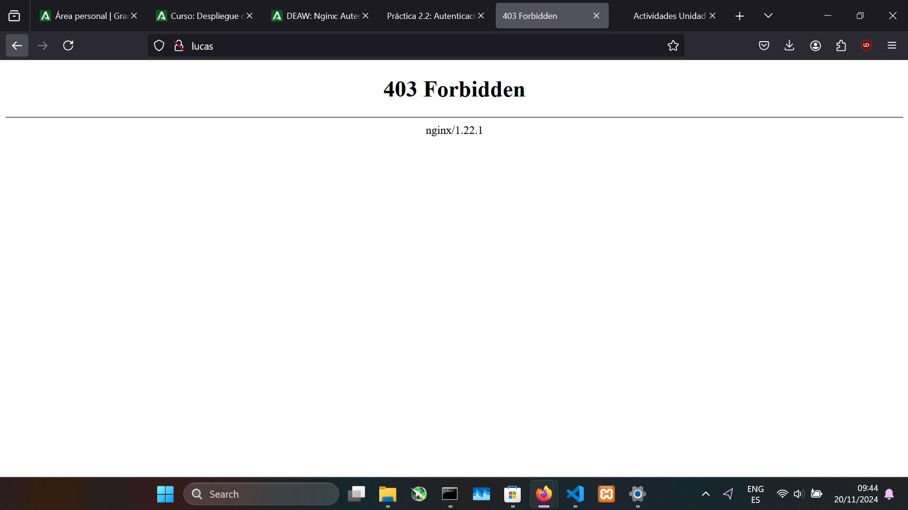

# Autenticación en Nginx

## Tarea 1
Modificado el Vagrantfile para añadirle dos usuarios y contraseñas:

```
sudo sh -c "echo 'lucas:$(openssl passwd -apr1 1234)' > /etc/nginx/.htpasswd"

sudo sh -c "echo 'gomez:$(openssl passwd -apr1 1234)' >> /etc/nginx/.htpasswd"
```

Aquí muestro el Vagrantfile. No he hecho muchos cambios salvo quitar el ftp y añadir una web distinta para esta práctica:

```
Vagrant.configure("2") do |config|
  config.vm.provision "shell", inline: <<-SHELL
     apt-get update
     apt-get install -y git
     apt-get install -y nginx
  SHELL

  config.vm.define "lucas" do |lucas|
    lucas.vm.box = "debian/bookworm64"
    lucas.vm.network "private_network", ip: "192.168.57.102"

    lucas.vm.provision "shell", inline: <<-SHELL

    mkdir -p /var/www/lucas
    cp -vr /vagrant/html /var/www/lucas/html
    chown -R www-data:www-data /var/www/lucas/html
    chmod -R 755 /var/www/lucas

    cp -v /vagrant/lucas /etc/nginx/sites-available/lucas
    ln -s /etc/nginx/sites-available/lucas /etc/nginx/sites-enabled/
    cp -v /vagrant/hosts /etc/hosts

    # Para el hosts del anfitrión Windows (hay posibilidad de que no funcione por temas de permisos. En caso de no funcioar, hay queintroducir manualmente en el archivo hosts de Windows los nombres y las IPs)
    powershell.exe -ExecutionPolicy Bypass -File add_hosts.ps1

    # Creación de usuarios y contraseñas para el acceso web

    sudo sh -c "echo 'lucas:$(openssl passwd -apr1 1234)' > /etc/nginx/.htpasswd"

    sudo sh -c "echo 'gomez:$(openssl passwd -apr1 1234)' >> /etc/nginx/.htpasswd"

    cat /etc/nginx/.htpasswd  

    # Segunda web
    mkdir -p /var/www/web2/html
    git clone https://github.com/Lucas08-ux/web2.git /var/www/web2/html
    chown -R www-data:www-data /var/www/web2/html
    chmod -R 755 /var/www/web2
    cp -v /vagrant/web2 /etc/nginx/sites-available/web2
    ln -s /etc/nginx/sites-available/web2 /etc/nginx/sites-enabled/

    systemctl restart nginx
    systemctl status nginx
    SHELL
  end # lucas
end
```
He modificado el fichero lucas que se situa en sites-avaliable para que deniegue el acceso a la máquina anfitriona, bloqueando a todas las IPs de mi red y permitiendo acceso al resto de IPs.

```
server {
    listen 80;
    listen [::]:80;
    root /var/www/lucas/html;
    index index.html index.htm index.nginx-debian.html;
    server_name lucas;

    # Bloqueo general de IP en el directorio raíz
    location / {
        deny 192.168.57.1/24;
        allow all;
        try_files $uri $uri/ =404;
    }

    # Bloqueo de acceso a /contact.html con autenticación básica
    location /contact.html {
        auth_basic "Área restringida";
        auth_basic_user_file /etc/nginx/.htpasswd;
    }
}
```
Aquí muestro una imagen del navegador negando el acceso a la IP 192.168.57.39:



Aquí muestro el error.log:
```
2024/11/20 08:26:29 [error] 1815#1815: *1 access forbidden by rule, client: 192.168.57.1, server: lucas, request: "GET / HTTP/1.1", host: "lucas"
```

## Tarea 2
Para la tarea 2, he modificado el fichero lucas dentro de sites-available para que permita el ordenador del anfitrión entrar y que niegue el acceso al resto de IPs. He usado satisfy all, porque también las credenciales de autenticación deben de ser correctas para acceder a la web. De esta manera, para poder entrar a la web, se deben de introducir las credenciales correctas y tener una IP válida.

```
server {
    listen 80;
    listen [::]:80;
    root /var/www/lucas/html;
    index index.html index.htm index.nginx-debian.html;
    server_name lucas;

    location / {
        satisfy all;
        allow 192.168.57.0/24;
        allow 127.0.0.1;
        deny all;
        
        auth_basic "Área restringida";
        auth_basic_user_file /etc/nginx/.htpasswd;

        try_files $uri $uri/ =404;
    }

    # Bloqueo de acceso a /contact.html con autenticación básica
    location /contact.html {
        auth_basic "Área restringida";
        auth_basic_user_file /etc/nginx/.htpasswd;
    }
}
```

Aquí muestro dos capturas de pantalla del navegador. En una de ellas aparece como me pide las credenciales y en la otra se ve cuando ya he entrado al introducir las credenciales correctas:


Aquí muestro algunos de los muchos logs que muestran que he accedido a la web. Estos se encuentran en el fichero access.log:

```
192.168.57.1 - lucas [20/Nov/2024:10:38:03 +0000] "GET /images/img8.png HTTP/1.1" 200 340121 "http://lucas/" "Mozilla/5.0 (Windows NT 10.0; Win64; x64; rv:132.0) Gecko/20100101 Firefox/132.0"
192.168.57.1 - lucas [20/Nov/2024:10:38:03 +0000] "GET /images/img10.png HTTP/1.1" 200 847972 "http://lucas/" "Mozilla/5.0 (Windows NT 10.0; Win64; x64; rv:132.0) Gecko/20100101 Firefox/132.0"
192.168.57.1 - lucas [20/Nov/2024:10:38:03 +0000] "GET /images/img9.png HTTP/1.1" 200 264861 "http://lucas/" "Mozilla/5.0 (Windows NT 10.0; Win64; x64; rv:132.0) Gecko/20100101 Firefox/132.0"
bfont.woff2?v=4.7.0 HTTP/1.1" 200 77160 "http://lucas/css/font-awesome.min.css" "Mozilla/5.0 (Windows NT 10.0; Win64; x64; rv:132.0) Gecko/20100101 Firefox/132.0" 
192.168.57.1 - lucas [20/Nov/2024:10:38:03 +0000] "GET /images/banner_img.png HTTP/1.1" 200 1638220 "http://lucas/" "Mozilla/5.0 (Windows NT 10.0; Win64; x64; rv:132.0) Gecko/20100101 Firefox/132.0"
```